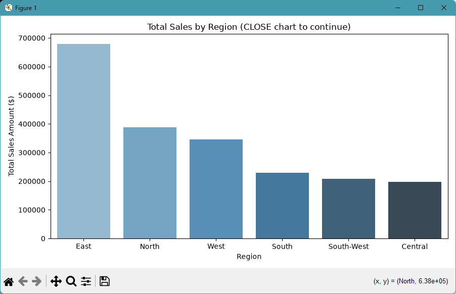
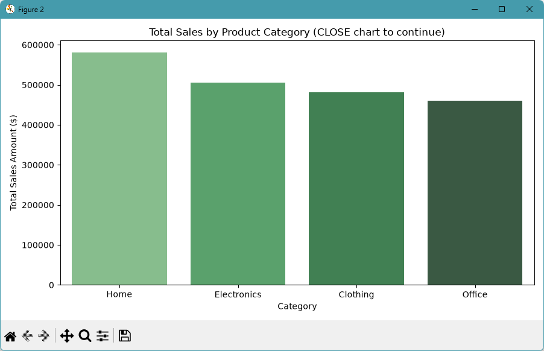

# bintel-03-cleaning

[](https://denisecase.github.io/pro-analytics-02/workflow-b-apply-example-project/)
[](./pyproject.toml)
[](./LICENSE)

> Professional Python project: cleaning and preparing smart sales data for ETVL.

## Project Description

This project focuses on cleaning raw business data and preparing it
for the Extract, Transform, Verify, Load (ETVL) process.

We work with a realistic smart sales dataset containing
customers, products, and sales records with intentional data quality issues.

We learn to:

- remove duplicate rows and fix invalid values
- standardize inconsistent text fields (region casing)
- handle invalid dates and non-numeric sale amounts
- enforce foreign key integrity across tables
- verify data quality before and after cleaning
- save clean prepared data ready for loading to the warehouse

## Working Files

You'll work with these areas:

- **data/raw** - raw smart sales CSV files (customers, products, sales)
- **docs/** - project narrative and documentation
- **src/bizintel/** - the app is an example; run only (no need to modify)
- **pyproject.toml** - update authorship & links
- **zensical.toml** - update authorship & links

## Instructions (pro-analytics-02)

Follow the
[step-by-step workflow guide](https://denisecase.github.io/pro-analytics-02/workflow-b-apply-example-project/)
to complete:

1. Phase 1. **Start & Run**
2. Phase 2. **Change Authorship**
3. Phase 3. **Read & Understand**
4. Phase 4. **Modify**
5. Phase 5. **Apply**

## Challenges

Challenges are expected.
Sometimes instructions may not quite match your operating system.
When issues occur, share screenshots, error messages, and details about what you tried.
Working through issues is part of implementing professional projects.

## Success

After completing Phase 1. **Start & Run**,
you'll have your own GitHub project,
and running the example module will print out:

```shell
========================
Executed successfully!
========================
```

A new file `project.log` will appear in the root project folder.

## Command Reference

<details>
<summary>Show command reference</summary>

### In a machine terminal (open in your `Repos` folder)

After you get a copy of this repo in your own GitHub account,
open a machine terminal in your `Repos` folder:

```shell
# Replace username with YOUR GitHub username.
git clone https://github.com/stoutjonathan101/bintel-03-cleaning

cd bintel-03-cleaning
code .
```

### In a VS Code terminal

These are listed for convenience.
For best results, follow the detailed instructions in
[pro-analytics-02 guide](https://denisecase.github.io/pro-analytics-02/).

```shell
uv self update
uv python pin 3.14
uv lock --upgrade
uv sync --extra dev --extra docs --upgrade

uvx pre-commit install
uvx pre-commit autoupdate

git add -A
uvx pre-commit run --all-files
# repeat if changes were made
uvx pre-commit run --all-files

# run the example module to verify the environment (.venv/)
uv run python -m bizintel.app_case

# run the example module to explore cleaning
uv run python -m bizintel.data_prep_case

# run common chores
uv run ruff format .
uv run ruff check . --fix
uv run python -m pyright
uv run python -m pytest
uv run python -m zensical build

# save progress
git add -A
git commit -m "update"
git push -u origin main
```

</details>

## Notes

- Use the **UP ARROW** and **DOWN ARROW** in the terminal to scroll through past commands.
- Use `CTRL+f` to find (and replace) text within a file.
- You do not need to add to or modify `tests/`. They are provided for example only.
- Many files are silent helpers. Explore as you like, but nothing is required.
- You do NOT need to understand everything; understanding builds naturally over time.

## Troubleshooting >>>

If you see something like this in your terminal: `>>>` or `...`
You accidentally started Python interactive mode.
It happens.
Press `Ctrl+c` (both keys together) or `Ctrl+Z` then `Enter` on Windows.


## Findings and Visuals

Take screenshots of your charts and provide them here with a discussion.
In Markdown, display a figure using:
an exclamation mark immediately followed by square brackets containing a useful caption
immediately followed by parentheses containing the relative path to your figure.

In your custom project:

- your figures and narrative should reflect your work
- this `README.md` should include your commands, process, and visuals
- `docs/index.md` should include your narrative

Replace these placeholders with screenshots from your own project run:





## Project Documentation

Additional project instructions, terms, and notes:

[docs/index.md](docs/index.md)

## Citation

[CITATION.cff](./CITATION.cff)

## License

[MIT](./LICENSE)
